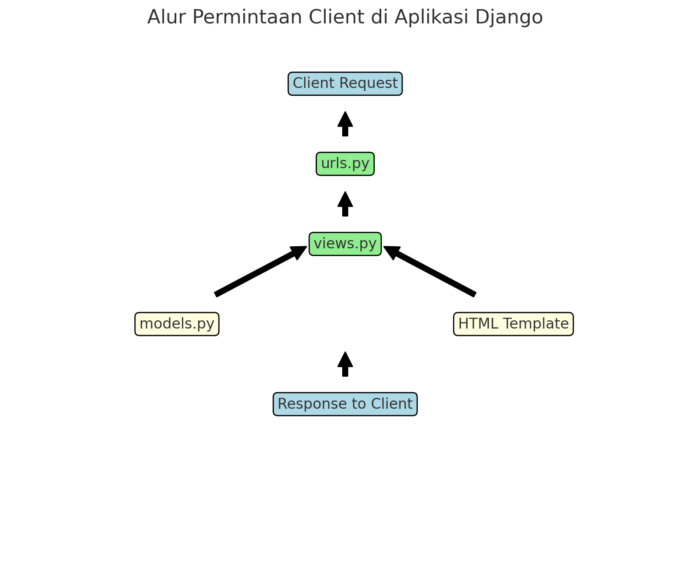
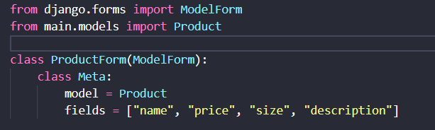
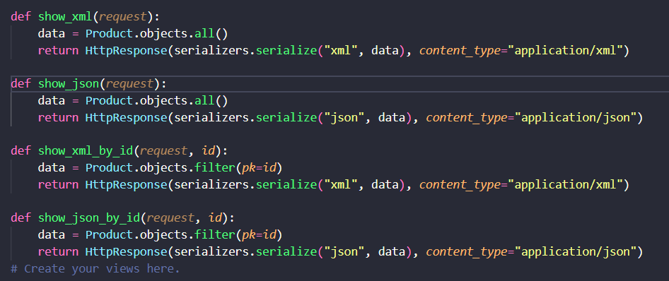
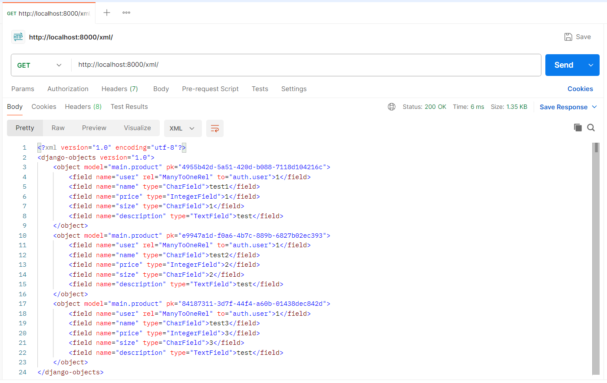
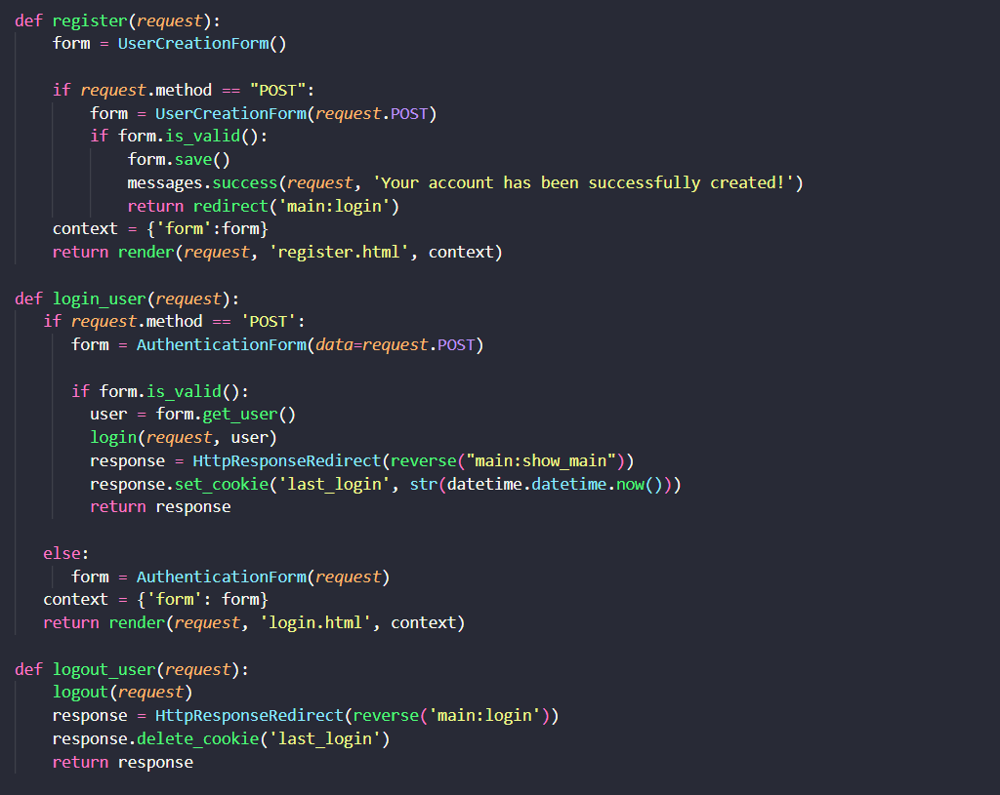
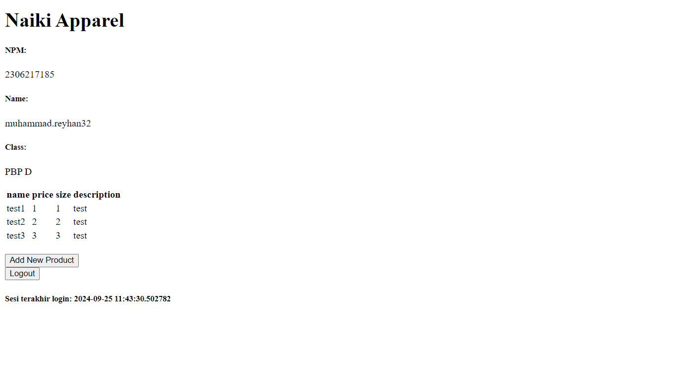
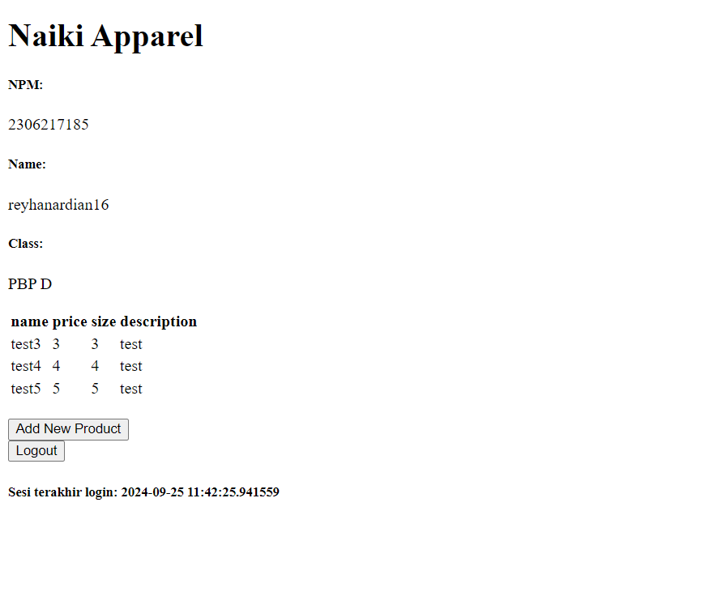
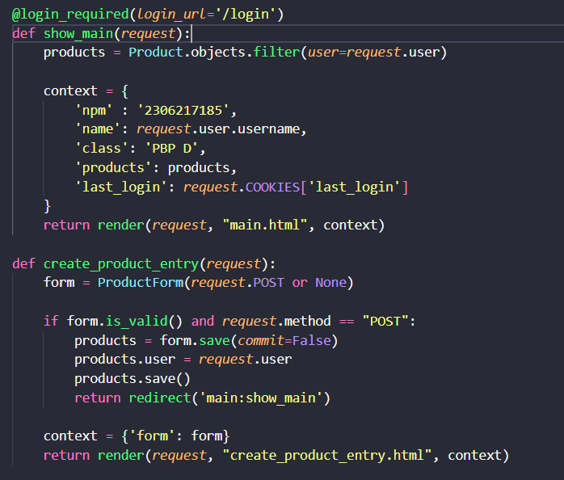

Nama : Muhammad Reyhan Ardian

NPM : 2306217185

Kelas : PBP D

1. Penjelasan Checklist 1
   
   - Membuat proyek django baru
       Dengan membuat direktori baru, menginstall dependencies, dan menghubungkan repositori git lokal dengan github
   - Membuat aplikasi dengan nama main
       Dengan membuat direktori baru main, dan melengkapi file-file yang diperlukan seperti template, urls, dll
   - Melakukan routing pada proyek dengan aplikasi main
       Dengan memodifikasi berkas urls.py
   - Membuat model pada aplikasi main dengan nama Product
       Dengan menambahkan atribut-atribut yang diperlukan seperti name, price, description pada class Product di berkas models.py
   - Membuat sebuah fungsi pada views.py untuk dikembalikan ke dalam sebuah template HTML yang menampilkan nama aplikasi serta nama dan kelas
       Dengan melengkapi data-data yang diperlukan oleh template agar dapat ditampilkan pada html
   - Membuat sebuah routing pada urls.py aplikasi main untuk memetakan fungsi yang telah dibuat pada views.py
       Dengan menambahkan isi baru dari url_patterns
   - Melakukan deployment ke PWS terhadap aplikasi yang sudah dibuat
      Dengan melakukan push pada direktori awal, lalu melakukan push terhadap tws agar dapat melakukan deployment
     
2. Penjelasan Request client terhadap aplikasi web yang berbasis django
   
   - Client Request
    Client mengirimkan permintaan HTTP (seperti GET atau POST) untuk mengakses halaman tertentu.
   - urls.py
   Django akan memeriksa pola URL di urls.py untuk menentukan view mana yang akan diaktifkan berdasarkan permintaan URL.
   - views.py    
    View yang sesuai akan dieksekusi, di mana logika aplikasi diproses. Jika diperlukan, view akan mengakses data dari model di models.py.
   - models.py
    Berisi struktur data dan logika untuk berinteraksi dengan database. Jika view memerlukan data, ia akan mengambil atau memanipulasinya melalui model ini.
   - HTML Template
    Setelah data diproses di view, hasilnya akan dimasukkan ke template HTML yang akan dirender menjadi halaman web dinamis yang akan ditampilkan kepada pengguna.
   - Response to Client
    Setelah template dirender, respons HTML dikirim kembali ke client untuk ditampilkan di browser.

3. Git dalam pengembangan perangkat lunak
   
      Git adalah alat pengontrol versi yang memungkinkan pengembang melacak, menyimpan, dan mengelola perubahan kode secara efisien. Dalam pengembangan perangkat lunak, Git berfungsi untuk memfasilitasi kolaborasi tim dengan mendukung banyak pengembang bekerja secara paralel melalui fitur *branching* dan *merging*. Dengan sistem ini, setiap pengembang dapat membuat cabang sendiri untuk bekerja tanpa mengganggu kode utama, lalu menggabungkannya setelah stabil. Git juga memungkinkan pengelolaan konflik kode, pencatatan perubahan historis, serta menyediakan cadangan otomatis karena sifatnya yang terdistribusi, menjadikannya esensial dalam proyek perangkat lunak.
   
4. Mengapa Django dijadikan permulaan pengerjaan perangkat lunak
   
      Django sering dijadikan permulaan pembelajaran pengembangan perangkat lunak karena sifatnya yang batteries-included, artinya Django menyediakan banyak fitur bawaan yang memudahkan pengembang pemula memulai tanpa harus mencari atau mengonfigurasi banyak alat tambahan. Django memiliki struktur yang jelas dan konvensi yang kuat, yang membantu pemula memahami prinsip-prinsip dasar pengembangan web seperti MVC (Model-View-Controller), manajemen database melalui ORM, serta konsep routing dan template. Selain itu, Django memiliki dokumentasi yang sangat baik dan komunitas yang besar, yang memudahkan pemula mendapatkan bantuan dan contoh kode. Django juga mendukung pengembangan proyek dari kecil hingga besar, sehingga pemula dapat dengan mudah meningkatkan keterampilan mereka seiring pertumbuhan proyek.
   
5. Mengapa model pada django disebut sebagai ORM
   
      Model pada Django disebut sebagai ORM (Object-Relational Mapping) karena Django menggunakan pendekatan ini untuk menghubungkan atau memetakan objek dalam kode Python ke tabel dalam basis data relasional. Dengan ORM, pengembang dapat berinteraksi dengan database menggunakan objek dan metode Python tanpa harus menulis perintah SQL secara langsung.

6. Mengapa kita memerlukan data delivery dalam pengimplementasian sebuah platform?

   Data delivery diperlukan dalam pengimplementasian sebuah platform karena platform modern sering kali melibatkan interaksi antar aplikasi atau antar komponen yang berjalan pada berbagai sistem atau perangkat. Data delivery memastikan data yang dikirimkan atau diterima dapat diproses secara efisien dan konsisten oleh komponen-komponen yang berinteraksi tersebut.

7. Mana yang lebih baik antara XML dan JSON? Mengapa JSON lebih populer dibandingkan XML?

   Antara XML dan JSON, pilihan terbaik tergantung pada kebutuhan spesifik. Namun, secara umum, JSON lebih sering dipilih dalam pengembangan aplikasi modern. Berikut adalah beberapa alasan perbandingan antara keduanya:

   JSON lebih ringkas: JSON menggunakan struktur yang lebih sederhana dan lebih kompak daripada XML. JSON tidak memerlukan penutupan tag seperti XML, sehingga file JSON cenderung lebih kecil.
Mudah dibaca manusia dan mesin: JSON lebih mudah dibaca oleh manusia karena tidak memerlukan tag penutup, dan lebih mudah diproses oleh mesin (khususnya pada aplikasi berbasis web yang menggunakan JavaScript).
Integrasi yang lebih baik dengan JavaScript: JSON sangat sesuai dengan bahasa JavaScript, karena JSON pada dasarnya adalah subset dari sintaksis objek JavaScript. Ini membuatnya sangat populer dalam pengembangan web, terutama pada aplikasi yang menggunakan AJAX.
   Parsing lebih cepat: Parsing JSON umumnya lebih cepat dan lebih efisien dibandingkan XML, karena JSON hanya memiliki satu tipe data (key-value pairs), sementara XML memiliki lebih banyak elemen struktural.
JSON lebih populer karena lebih ringan, cepat, dan memiliki integrasi yang baik dengan teknologi web modern. XML lebih digunakan dalam situasi yang memerlukan validasi data yang lebih kompleks dan lebih formal, seperti dalam aplikasi enterprise atau ketika menggunakan standar seperti SOAP.

8. Fungsi dari method is_valid() pada form Django dan mengapa kita membutuhkannya?

   Method is_valid() pada form Django berfungsi untuk:

   Memvalidasi data form: Method ini memeriksa apakah data yang dimasukkan ke dalam form sesuai dengan aturan validasi yang ditentukan pada form tersebut (seperti tipe data, batas panjang, format, dll.).
Mengakses data yang divalidasi: Jika validasi berhasil, Django akan menyimpan data yang telah dibersihkan dalam atribut cleaned_data, yang dapat digunakan untuk keperluan selanjutnya (misalnya untuk menyimpan data ke dalam database).
   Menangani error: Jika validasi gagal, Django akan menyimpan informasi mengenai error di atribut errors, sehingga kita dapat memberikan umpan balik kepada pengguna.
Kita membutuhkan method ini untuk memastikan bahwa data yang diterima dari pengguna aman dan sesuai dengan kriteria yang diharapkan sebelum melakukan operasi seperti penyimpanan ke database. Jika tidak, data yang tidak valid atau berbahaya bisa merusak aplikasi atau menyebabkan masalah keamanan.

9. Mengapa kita membutuhkan csrf_token saat membuat form di Django? Apa yang dapat terjadi jika kita tidak menambahkan csrf_token pada form Django? Bagaimana hal tersebut dapat dimanfaatkan oleh penyerang?

   Kita membutuhkan csrf_token saat membuat form di Django untuk mencegah serangan Cross-Site Request Forgery (CSRF). CSRF adalah jenis serangan di mana penyerang mengirimkan permintaan berbahaya atas nama pengguna tanpa sepengetahuan atau persetujuan mereka. Token CSRF bekerja dengan cara memastikan bahwa permintaan yang diterima oleh server berasal dari sumber yang sah, yaitu dari halaman yang benar-benar diakses oleh pengguna. Penyalahgunaan otorisasi: Serangan CSRF dapat dimanfaatkan untuk melakukan tindakan atas nama pengguna yang sudah login, seperti mengirim pesan atau menghapus data penting, karena server menganggap permintaan tersebut berasal dari pengguna yang sah. Dengan adanya csrf_token, server dan aplikasi dapat memverifikasi bahwa setiap permintaan POST, PUT, atau DELETE berasal dari sumber yang valid, yaitu halaman aplikasi yang dikontrol oleh server tersebut, sehingga serangan CSRF dapat dicegah.

10. Penjelasan Checklist 3

   - Membuat input form untuk menambahkan objek model pada app sebelumnya.

   - Menambahkan fungsi views

   - Membuat routing URL

11. Postman

13. Perbedaan antara HttpResponseRedirect() dan redirect()

   HttpResponseRedirect() adalah class dalam Django yang digunakan untuk mengarahkan pengguna ke URL lain. Bertujuan untuk mengembalikan objek respons HTTP dengan status kode 302, yang mengindikasikan bahwa URL tujuan telah dialihkan sementara. URL harus dimasukkan secara eksplisit sebagai argumen untuk menentukan tujuan pengalihan.
   redirect() adalah fungsi bantu (helper function) Django yang menyederhanakan penggunaan pengalihan (redirect). Fungsi ini bertujuan untuk memasukkan URL, nama view, atau bahkan objek model, dan Django secara otomatis menangani proses pengalihan ke tujuan yang sesuai. Di belakang layar, redirect() menggunakan HttpResponseRedirect tetapi lebih mudah digunakan dan fleksibel.

14. Cara Menghubungkan Model Product dengan User dalam Django
 
   Penggunaan ForeignKey: Untuk menghubungkan model Product dengan User, kita menggunakan ForeignKey. Ini adalah hubungan satu-ke-banyak (one-to-many), artinya satu pengguna (User) dapat memiliki banyak produk (Product), tetapi satu produk hanya bisa dimiliki oleh satu pengguna. Hubungan ini diimplementasikan dengan menambahkan field owner = models.ForeignKey(User, on_delete=models.CASCADE) di model Product.

on_delete=models.CASCADE: Parameter on_delete=models.CASCADE berarti jika pengguna dihapus, maka semua produk yang terkait dengan pengguna tersebut juga akan dihapus dari database.

15. Perbedaan antara Authentication dan Authorization

   Authentication (Autentikasi) adalah proses memverifikasi identitas pengguna. Ini biasanya dilakukan saat pengguna memasukkan kredensial, seperti username dan password. Django mengimplementasikan autentikasi melalui sistem otentikasi bawaan, yang meliputi model pengguna (User) dan middleware yang memeriksa sesi pengguna.

   Authorization (Otorisasi) adalah proses menentukan hak akses pengguna setelah identitas mereka terverifikasi. Setelah pengguna berhasil login, Django menggunakan otorisasi untuk menentukan sumber daya atau tindakan apa yang diizinkan untuk pengguna tersebut, misalnya apakah mereka dapat mengakses halaman admin atau melakukan perubahan pada data tertentu.

16. Bagaimana Django Mengingat Pengguna yang Telah Login?

   Django mengingat pengguna yang telah login menggunakan session framework. Setelah pengguna berhasil login, Django menyimpan informasi sesi dalam cookie di browser pengguna. Django menggunakan session ID yang disimpan dalam cookie ini untuk mengenali pengguna yang sama di setiap permintaan berikutnya. Cookies digunakan untuk menyimpan data kecil yang dikirim dari server ke klien. Selain digunakan untuk sesi login, cookies juga bisa digunakan untuk menyimpan preferensi pengguna, data pelacakan, atau status aplikasi.

17. Penjelasan checklist 4

- Implementasi fungsi registrasi, login, dan logout

- Dummy data di lokal

- Menghubungkan User dengan Product dan menampilkan username pada user yang sedang logged in serta menampilkan last login menggunakan cookies

18. Jika terdapat beberapa CSS selector untuk suatu elemen HTML, jelaskan urutan prioritas pengambilan CSS selector tersebut!

   Urutan Prioritas Pengambilan CSS Selector mengikuti konsep specificity, di mana beberapa selector dapat diterapkan pada elemen yang sama. Urutan prioritasnya dimulai dari selector elemen HTML seperti p atau div, kemudian dilanjutkan dengan class selector yang dimulai dengan tanda titik (.), diikuti oleh attribute selector dan pseudo-class seperti [type="text"] atau :hover. Selanjutnya, ID selector (#id-name) memiliki prioritas lebih tinggi, disusul oleh inline CSS yang diterapkan langsung dalam elemen HTML. Yang terkuat adalah penggunaan !important dalam suatu aturan CSS, yang akan mengesampingkan semua aturan lainnya kecuali ada aturan lain yang juga menggunakan !important.

19. Mengapa responsive design menjadi konsep yang penting dalam pengembangan aplikasi web? Berikan contoh aplikasi yang sudah dan belum menerapkan responsive design!

   Responsive design adalah konsep penting dalam pengembangan aplikasi web karena memungkinkan situs web menyesuaikan tampilan berdasarkan ukuran perangkat yang digunakan, baik itu desktop, tablet, atau ponsel. Ini penting karena pengguna mengakses situs dari berbagai perangkat dengan ukuran layar yang berbeda, sehingga situs perlu memastikan pengalaman pengguna tetap optimal. Selain meningkatkan pengalaman pengguna, responsive design juga penting untuk SEO, karena mesin pencari seperti Google lebih memprioritaskan situs yang ramah mobile. Contoh aplikasi yang sudah menerapkan responsive design adalah Twitter, yang secara otomatis menyesuaikan tata letak dan ukuran berdasarkan perangkat yang digunakan. Di sisi lain, beberapa situs lama mungkin tidak responsive, sehingga tampilannya menjadi kacau ketika diakses melalui perangkat mobile.

20. Jelaskan perbedaan antara margin, border, dan padding, serta cara untuk mengimplementasikan ketiga hal tersebut!

   Margin, border, dan padding adalah konsep penting dalam pengaturan tata letak CSS. Margin adalah jarak luar yang memisahkan elemen dari elemen lain di sekitarnya, memberikan ruang di luar elemen. Border adalah garis yang mengelilingi elemen, memisahkan isi elemen dari elemen-elemen sekitarnya, dan dapat disesuaikan dengan ketebalan, warna, dan gaya. Padding adalah jarak antara konten elemen dengan border-nya, sehingga menambah ruang di dalam elemen tanpa mempengaruhi jarak ke elemen lain. Dengan memahami margin, border, dan padding, kita dapat mengontrol dengan presisi bagaimana elemen-elemen di halaman web berinteraksi satu sama lain dalam hal tata letak dan spasi.
   
21. Jelaskan konsep flex box dan grid layout beserta kegunaannya!

    Flexbox dan grid layout adalah dua teknik layout modern yang sangat berguna untuk pengaturan tata letak di CSS. Flexbox adalah sistem layout satu dimensi yang memungkinkan elemen disusun baik secara horizontal maupun vertikal dalam satu baris atau kolom. Flexbox memberikan fleksibilitas tinggi dalam mendistribusikan ruang antar elemen, serta memudahkan untuk menyelaraskan elemen di sepanjang sumbu utama dan sumbu silang. Sebaliknya, grid layout adalah sistem layout dua dimensi yang memungkinkan pengaturan elemen dalam baris dan kolom secara bersamaan. Grid layout lebih cocok untuk struktur halaman yang lebih kompleks dengan berbagai area seperti header, sidebar, dan footer, memberikan kontrol lebih besar dalam mendefinisikan area layout secara eksplisit.

24. Penjelasan Checklist 5
- 
